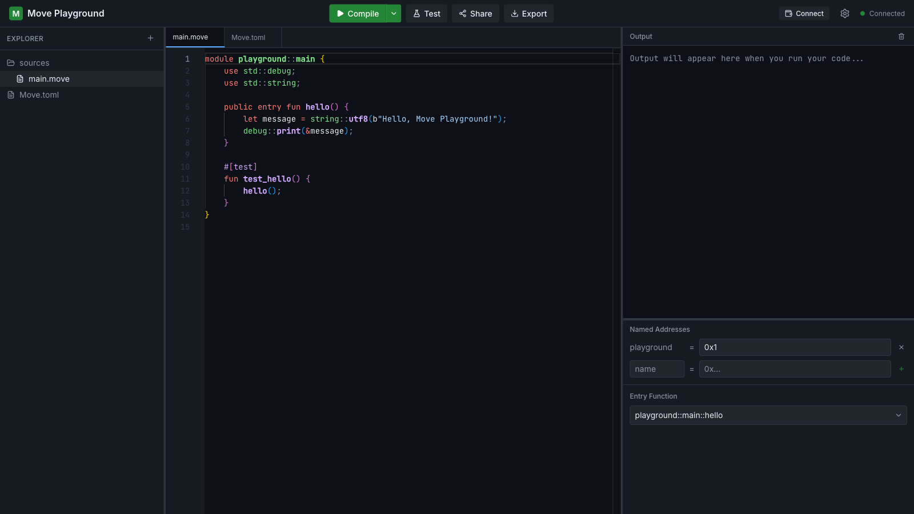
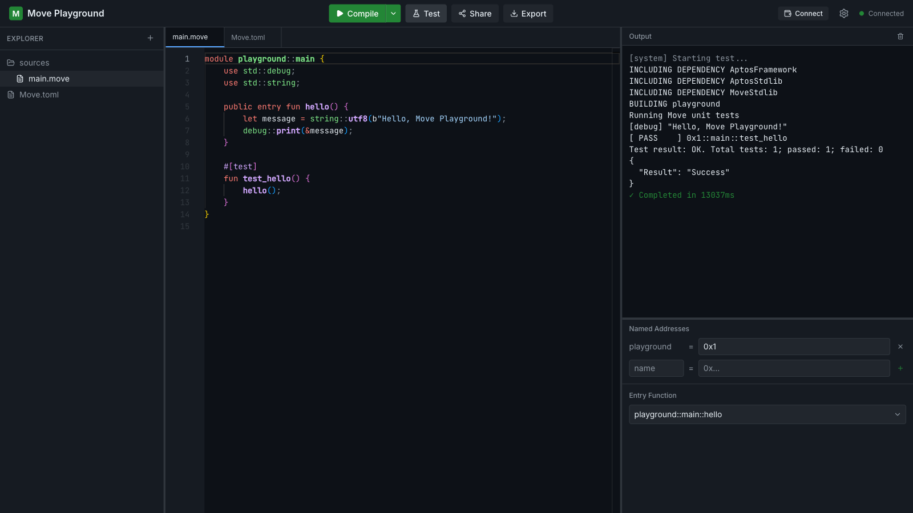

# Aptos Move Playground

An open, browser-based playground for the [Move](https://move-language.github.io/move/) programming language on Aptos — inspired by the Rust Playground.

Write Move modules and scripts in a real editor, compile them, run entry functions, execute unit tests, and iterate — all without installing anything or setting up a local chain.



## Features

- **Monaco editor** with custom Move and TOML syntax highlighting, inline compiler error markers, vim mode, and a multi-file workspace tree (including a guarded `Move.toml`)
- **WebSocket streaming execution** — compile, run, and test output streams token-by-token from the sandbox
- **Real toolchain** — every run executes `aptos move {compile,test}` inside an isolated temporary workspace using a pinned [Aptos CLI](https://aptos.dev/en/build/cli)
- **Named addresses UI** — define address values (`0x1`, devnet accounts, …) used across builds
- **Share** workspaces via GitHub Gists, load them back by URL
- **Export** the workspace as a ZIP archive
- **Devnet publish/run** — connect any AIP-62 wallet (or generate a throwaway devnet account) to publish packages and call entry functions on-chain
- **Hardened backend** — per-IP concurrency limiting, execution timeouts, RLIMIT-based resource caps, origin allow-listing



## Architecture

```
┌────────────────────────────── Browser ──────────────────────────────┐
│  React 19 · Vite · Zustand · Monaco · @aptos-labs/ts-sdk (devnet)   │
└───────────▲─────────────────────────────────▲───────────────────────┘
            │ static files                    │ REST + WebSocket (same-origin / proxy)
┌───────────┴──────────┐        ┌─────────────┴──────────────────────────┐
│ Caddy / Vite / CDN    │        │ Rust backend (Axum)                    │
│                       │        │  • auth: signed mp_auth cookie         │
│                       │        │  • rate limit + validation             │
│                       │        │  • share/load via GitHub Gists API     │
│                       │        │  • executor → temp package workspace   │
│                       │        └─────────────┬──────────────────────────┘
│                       │                      │ spawns aptos CLI per run
│                       │        ┌─────────────▼──────────────────────────┐
└───────────────────────┘        │ Aptos CLI (compile / test / publish)   │
                                 └────────────────────────────────────────┘
```

- The frontend is fully static; it talks to the backend over `/api/*` REST routes and one WebSocket at `/ws/execute`.
- For every request the backend materializes a disposable Cargo-style Move package under a temp directory, runs the requested CLI command with resource limits applied, streams stdout/stderr over the socket, then deletes the workspace.
- `run` and `test` reuse a warm local network profile managed by the CLI; wallet-driven publish/run flows submit transactions **from the browser** through the user's own wallet connection.
- See [`docs/`](docs/) for design documents (backend, frontend, specification).

### Repository layout

```
move-ide/
├── backend/            # Rust (Axum) API + WebSocket server
│   └── src/
│       ├── api/        # HTTP handlers (health, share) + WS executor
│       ├── service/    # execution engine, validator, output parser, rate limiter
│       ├── sandbox/    # temp workspace management
│       ├── auth.rs     # cookie middleware + HMAC verification
│       └── config.rs   # environment configuration
├── frontend/           # React + Vite + TypeScript UI
│   ├── src/components/ # editor panes, file tree, header, config panel…
│   ├── src/store/      # zustand stores (workspace, ui)
│   ├── src/hooks/      # WebSocket transport + execution orchestration
│   ├── src/lib/        # Monaco language definitions (Move, TOML)
│   ├── public/         # favicons, PWA manifest, OG images, robots/sitemap
│   └── e2e/            # Playwright end-to-end specs
├── docs/               # design docs + screenshots
└── docker-compose.yml  # production-ish single-host deployment (Caddy + backend)
```

## Getting started

### Prerequisites

| Tool | Version | Notes |
| --- | --- | --- |
| [Rust](https://rustup.rs/) | stable | backend |
| [Bun](https://bun.sh/) | ≥ 1.1 | frontend package manager & runner (Node ≥ 22 also works for scripts) |
| [Aptos CLI](https://aptos.dev/en/build/cli) | recent | the actual Move compiler/test runner |

```bash
# Install the Aptos CLI
curl -fsSL "https://aptos.dev/scripts/install_cli.sh" | bash
```

### Run locally

```bash
# Terminal 1 — backend on http://localhost:8080
cd backend && cargo run

# Terminal 2 — frontend on http://localhost:3000 (proxies /api and /ws)
cd frontend && bun install && bun run dev
```

> If port 8080 is taken (e.g. by an Aptos localnet), start the backend elsewhere and point the proxy at it:
>
> ```bash
> PLAYGROUND_PORT=39221 cargo run                            # terminal 1
> PLAYGROUND_BACKEND_ORIGIN=http://127.0.0.1:39221 bun run dev  # terminal 2
> ```

The frontend expects a same-origin auth endpoint that sets the backend's session cookie (see [Access control](#access-control)). Without it the editor still works but shares and WS execution will be rejected by the backend.

### Docker

```bash
docker compose up --build
```

Caddy terminates TLS on ports 80/443 and reverse-proxies the API host to the backend container. Configure the environment (secrets, origins, tokens) in `.env` next to `docker-compose.yml`.

## Configuration

Backend (env vars, all optional except where noted):

| Variable | Default | Description |
| --- | --- | --- |
| `AUTH_JWT_SECRET` | `dev-secret` | HMAC secret for session cookies (**set a real secret in production**) |
| `PLAYGROUND_FRONTEND_ORIGINS` | `http://localhost:3000` | Comma-separated allow-list of browser origins |
| `PLAYGROUND_HOST` / `PLAYGROUND_PORT` | `0.0.0.0` / `8080` | Listen address |
| `PLAYGROUND_TIMEOUT_SECS` | `30` | Hard timeout per command execution |
| `PLAYGROUND_MAX_MEMORY_MB` | `1024` | Address-space cap for spawned processes (**Linux only**; ignored on macOS where `RLIMIT_AS` is unsupported) |
| `PLAYGROUND_MAX_DISK_MB` | `100` | Max file-size writes per process |
| `PLAYGROUND_CONCURRENT_PER_IP` | `2` | Concurrent executions allowed per client IP |
| `PLAYGROUND_TRUST_PROXY_HEADERS` | `false` | Honor `X-Forwarded-For` when computing client IPs |
| `GITHUB_TOKEN` | – | GitHub token used to create/read Gist shares |
| `RUST_LOG` | `info` | Tracing filter |

Frontend:

| Variable | When | Description |
| --- | --- | --- |
| `VITE_BACKEND_URL` | build time | Public base URL of a cross-origin backend (leave empty for same-origin/local dev) |
| `PLAYGROUND_BACKEND_ORIGIN` | dev only | Overrides the Vite dev-proxy target (see above) |

Generate a strong auth secret with `./scripts/gen-auth-secret.sh`.

### Access control

The backend gates state-changing routes (`POST /api/share`, `GET /api/load/{id}`, `WS /ws/execute`) behind a short-lived HS256 JWT delivered in an `mp_auth` HttpOnly cookie whose claims bind it to the requesting origin. Issuance is deliberately kept outside the execution service: deploy a tiny issuer endpoint next to your origin (the frontend calls `POST /api/auth/issue`) that mints `{iss, aud, exp, origin, jti}` cookies with the shared `AUTH_JWT_SECRET`. This keeps raw execution capacity off the public internet while letting static hosting serve the UI.

## HTTP & WebSocket API

| Endpoint | Description |
| --- | --- |
| `GET /health` | Liveness + Aptos CLI version report |
| `POST /api/share` | Create a Gist from the workspace, returns a permalink (auth required) |
| `GET /api/load/:id` | Fetch a previously shared Gist (auth required) |
| `GET /ws/execute` | Streaming execution socket (auth required) |

Client frames carry `{ command, files, named_addresses?, entry_function?, options? }` where `command ∈ compile \| run \| test \| build_publish_payload`. Server frames are `started`, `stdout`, `stderr`, `errors` (parsed compiler diagnostics used for inline markers), `done` (with duration/exit code and, for publish builds, the compiled payload), and `failed`.

Wallet/devnet flows (connect, fund, publish, run) are executed client-side with `@aptos-labs/ts-sdk`; the backend never holds keys.

## Development

```bash
make lint     # cargo clippy + biome check
make format   # cargo fmt + biome format
make test     # backend unit tests + frontend vitest suite
make test-e2e # Playwright suite (auto-starts the Vite server)
```

Dependency hygiene: `cargo audit` (config in `backend/.cargo/audit.toml`) runs clean, Dependabot keeps both ecosystems patched weekly (grouped minor/patch updates), and the frontend pins known-good versions of its transitive UI dependencies where upstream ranges lag security fixes.

## License

[MIT](LICENSE)
