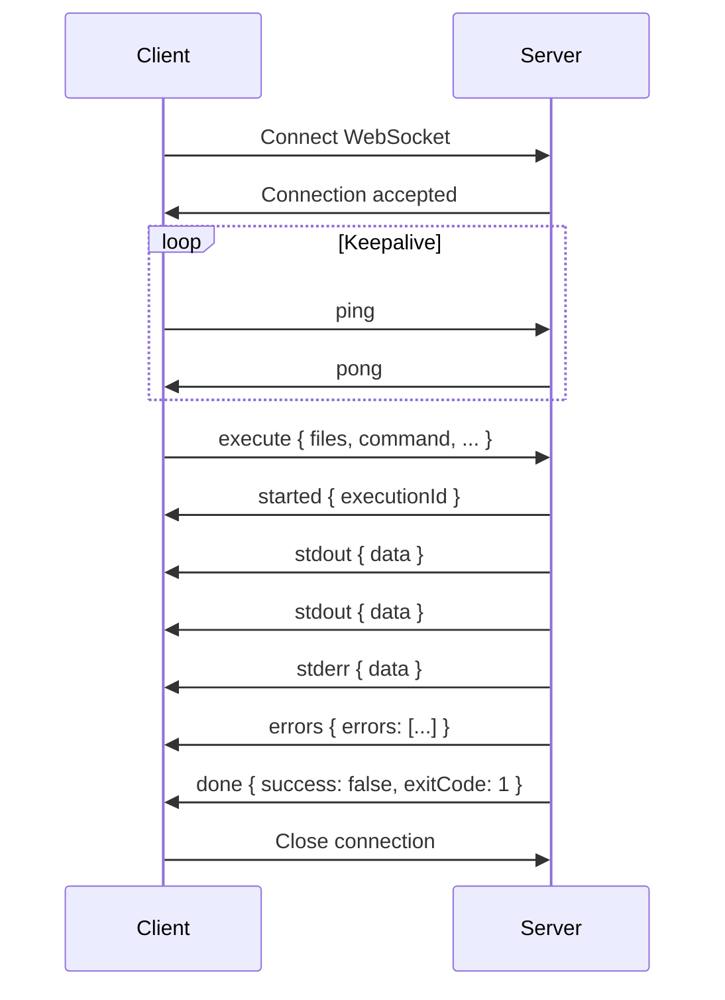

# Backend Design: Aptos Move Playground

## Tech Stack
| Component | Technology | Version |
|-----------|------------|---------|
| Language | Rust | 1.75+ |
| Framework | Axum | 0.7+ |
| Async Runtime | Tokio | 1.35+ |
| Serialization | serde, serde_json | latest |
| TOML Parsing | toml | 0.8+ |
| HTTP Client | reqwest | 0.11+ |
| WebSocket | axum (built-in) + tokio-tungstenite | - |
| Temp Files | tempfile | 3.x |
| UUID | uuid | 1.x |
| Regex | regex | 1.x |
| Tracing | tracing, tracing-subscriber | 0.1+ |

---

## Architecture

### Module Structure
```
playground-backend/
├── Cargo.toml
├── Dockerfile
├── src/
│   ├── main.rs                 # Axum app, routes, graceful shutdown
│   ├── config.rs               # Environment config
│   ├── error.rs                # Error types, API error responses
│   ├── api/
│   │   ├── mod.rs
│   │   ├── execute.rs          # WebSocket /ws/execute
│   │   ├── share.rs            # POST /api/share
│   │   ├── load.rs             # GET /api/load/:id
│   │   └── health.rs           # GET /health
│   ├── service/
│   │   ├── mod.rs
│   │   ├── executor.rs         # Sandbox orchestration
│   │   ├── parser.rs           # CLI output parsing
│   │   ├── validator.rs        # Input validation
│   │   └── gist.rs             # GitHub Gist API
│   ├── sandbox/
│   │   ├── mod.rs
│   │   ├── workspace.rs        # Temp dir management
│   │   └── process.rs          # CLI process spawning
│   └── types/
│       ├── mod.rs
│       ├── request.rs          # API request types
│       ├── response.rs         # API response types
│       └── ws.rs               # WebSocket message types
└── tests/
    ├── integration/
    │   ├── execute_test.rs
    │   └── share_test.rs
    └── fixtures/
        └── sample_move/
```

---

## Configuration

### Environment Variables
```bash
# Server
PLAYGROUND_HOST=0.0.0.0
PLAYGROUND_PORT=8080
PLAYGROUND_CORS_ORIGINS=*

# Execution Limits
PLAYGROUND_TIMEOUT_SECS=10
PLAYGROUND_MAX_MEMORY_MB=1024
PLAYGROUND_MAX_DISK_MB=100
PLAYGROUND_MAX_FILES=20
PLAYGROUND_MAX_FILE_SIZE_KB=50
PLAYGROUND_MAX_STDOUT_KB=1024
PLAYGROUND_CONCURRENT_PER_IP=2

# External Services
GITHUB_TOKEN=ghp_xxx  # Optional, for authenticated Gist creation
APTOS_CLI_PATH=/usr/local/bin/aptos

# Feature Flags
PLAYGROUND_ENABLE_TESTS=true
PLAYGROUND_ENABLE_PROVER=false
```

### Config Struct
```rust
#[derive(Clone, Debug)]
pub struct Config {
    pub host: String,
    pub port: u16,
    pub cors_origins: Vec<String>,
    
    pub timeout_secs: u64,
    pub max_memory_mb: u64,
    pub max_disk_mb: u64,
    pub max_files: usize,
    pub max_file_size_kb: usize,
    pub max_stdout_kb: usize,
    pub concurrent_per_ip: usize,
    
    pub github_token: Option<String>,
    pub aptos_cli_path: PathBuf,
    
    pub enable_tests: bool,
    pub enable_prover: bool,
}
```

---

## API Specification

### Health Check
```
GET /health
Response: 200 OK
{
  "status": "healthy",
  "version": "0.1.0",
  "aptos_cli_version": "2.4.0"
}
```

### Share Snippet
```
POST /api/share
Content-Type: application/json

Request:
{
  "files": [
    {
      "path": "sources/main.move",
      "content": "module playground::main { ... }"
    },
    {
      "path": "Move.toml",
      "content": "[package]\nname = \"playground\"..."
    }
  ],
  "namedAddresses": {
    "playground": "0x1"
  }
}

Response: 201 Created
{
  "id": "a1b2c3d4e5f6",
  "url": "https://moveplayground.sed.fyi/?id=a1b2c3d4e5f6",
  "gistUrl": "https://gist.github.com/a1b2c3d4e5f6"
}

Errors:
- 400 Bad Request: Invalid input
- 429 Too Many Requests: Rate limited
- 502 Bad Gateway: GitHub API error
```

### Load Snippet
```
GET /api/load/:id

Response: 200 OK
{
  "files": [...],
  "namedAddresses": {...},
  "createdAt": "2024-01-15T10:30:00Z"
}

Errors:
- 404 Not Found: Gist does not exist
- 502 Bad Gateway: GitHub API error
```

---

## WebSocket Protocol

### Connection
```
ws://localhost:8080/ws/execute
```

### Client → Server Messages
```typescript
// Execute request
{
  "type": "execute",
  "payload": {
    "files": [
      { "path": "sources/main.move", "content": "..." },
      { "path": "Move.toml", "content": "..." }
    ],
    "command": "compile" | "run" | "test",
    "entryFunction": "playground::main::hello",  // Required for "run"
    "namedAddresses": { "playground": "0x1" },
    "options": {
      "verbose": false,
      "includeBytecode": false
    }
  }
}

// Cancel request
{
  "type": "cancel"
}

// Ping (keepalive)
{
  "type": "ping"
}
```

### Server → Client Messages
```typescript
// Pong
{ "type": "pong" }

// Execution started
{
  "type": "started",
  "payload": {
    "executionId": "uuid",
    "command": "compile"
  }
}

// Stdout chunk
{
  "type": "stdout",
  "payload": {
    "data": "Compiling playground v0.0.1...\n"
  }
}

// Stderr chunk
{
  "type": "stderr",
  "payload": {
    "data": "warning: unused variable `x`\n"
  }
}

// Compiler/runtime errors (parsed)
{
  "type": "errors",
  "payload": {
    "errors": [
      {
        "file": "sources/main.move",
        "line": 10,
        "column": 5,
        "endLine": 10,
        "endColumn": 15,
        "message": "unbound variable `foo`",
        "severity": "error",
        "code": "E01001"
      }
    ]
  }
}

// Execution complete
{
  "type": "done",
  "payload": {
    "success": true,
    "exitCode": 0,
    "durationMs": 1523,
    "bytecode": null  // Optional compiled bytecode
  }
}

// Execution failed (system error, not compiler error)
{
  "type": "failed",
  "payload": {
    "reason": "timeout" | "memory_limit" | "cancelled" | "internal_error",
    "message": "Execution timed out after 10 seconds"
  }
}
```

### Connection Lifecycle


---

## Input Validation

### Validation Pipeline
```rust
pub struct Validator {
    config: Config,
}

impl Validator {
    pub fn validate_execute_request(&self, req: &ExecuteRequest) -> Result<(), ValidationError> {
        self.validate_file_count(&req.files)?;
        self.validate_file_sizes(&req.files)?;
        self.validate_file_paths(&req.files)?;
        self.validate_move_toml(&req.files)?;
        self.validate_git_dependencies(&req.files)?;
        self.validate_named_addresses(&req.named_addresses)?;
        self.validate_entry_function(&req.entry_function)?;
        Ok(())
    }
}
```

### File Count
- **Max**: 20 files
- **Min**: 1 file (at least one .move or Move.toml)

### File Sizes
- **Per file**: Max 50KB
- **Total**: Max 1MB

### Path Sanitization
```rust
fn validate_path(path: &str) -> Result<(), ValidationError> {
    // Reject absolute paths
    if path.starts_with('/') || path.starts_with('\\') {
        return Err(ValidationError::AbsolutePath);
    }
    
    // Reject path traversal
    if path.contains("..") {
        return Err(ValidationError::PathTraversal);
    }
    
    // Reject hidden files (except .move which doesn't exist)
    if path.split('/').any(|p| p.starts_with('.') && p != ".") {
        return Err(ValidationError::HiddenFile);
    }
    
    // Whitelist extensions
    let valid_extensions = ["move", "toml"];
    let ext = Path::new(path).extension().and_then(|e| e.to_str());
    if !ext.map(|e| valid_extensions.contains(&e)).unwrap_or(false) {
        return Err(ValidationError::InvalidExtension);
    }
    
    Ok(())
}
```

### Move.toml Validation
```rust
fn validate_move_toml(content: &str) -> Result<(), ValidationError> {
    let toml: toml::Value = toml::from_str(content)?;
    
    // Must have [package] section
    let package = toml.get("package")
        .ok_or(ValidationError::MissingPackage)?;
    
    // Package name must be valid identifier
    let name = package.get("name")
        .and_then(|v| v.as_str())
        .ok_or(ValidationError::MissingPackageName)?;
    
    if !name.chars().all(|c| c.is_alphanumeric() || c == '_') {
        return Err(ValidationError::InvalidPackageName);
    }
    
    // Validate dependencies
    if let Some(deps) = toml.get("dependencies") {
        validate_dependencies(deps)?;
    }
    
    Ok(())
}
```

### Git URL Allowlist
```rust
const ALLOWED_GIT_HOSTS: &[&str] = &[
    "github.com",
    "gitlab.com",
];

fn validate_git_url(url: &str) -> Result<(), ValidationError> {
    let parsed = url::Url::parse(url)?;
    let host = parsed.host_str().ok_or(ValidationError::InvalidGitUrl)?;
    
    if !ALLOWED_GIT_HOSTS.contains(&host) {
        return Err(ValidationError::DisallowedGitHost(host.to_string()));
    }
    
    Ok(())
}
```

### Named Address Validation
```rust
fn validate_address(addr: &str) -> Result<(), ValidationError> {
    // Allow placeholder
    if addr == "_" {
        return Ok(());
    }
    
    // Must be hex format
    if !addr.starts_with("0x") {
        return Err(ValidationError::InvalidAddressFormat);
    }
    
    let hex_part = &addr[2..];
    if hex_part.is_empty() || hex_part.len() > 64 {
        return Err(ValidationError::InvalidAddressLength);
    }
    
    if !hex_part.chars().all(|c| c.is_ascii_hexdigit()) {
        return Err(ValidationError::InvalidAddressHex);
    }
    
    Ok(())
}

// Reserved addresses that cannot be overridden
const RESERVED_ADDRESSES: &[&str] = &[
    "std",
    "aptos_std", 
    "aptos_framework",
    "aptos_token",
    "aptos_token_objects",
];
```

---

## Error Parsing

### Aptos CLI Error Patterns
```rust
lazy_static! {
    // Main error pattern
    // error[E01001]: unbound variable `foo`
    //    ┌─ sources/main.move:10:5
    static ref ERROR_PATTERN: Regex = Regex::new(
        r"error\[(?P<code>E\d+)\]: (?P<message>.+)\n\s+┌─ (?P<file>[^:]+):(?P<line>\d+):(?P<col>\d+)"
    ).unwrap();
    
    // Warning pattern
    static ref WARNING_PATTERN: Regex = Regex::new(
        r"warning\[(?P<code>W\d+)\]: (?P<message>.+)\n\s+┌─ (?P<file>[^:]+):(?P<line>\d+):(?P<col>\d+)"
    ).unwrap();
    
    // Test failure pattern
    // ┌── test_hello ──────
    // │ error: ...
    static ref TEST_FAILURE_PATTERN: Regex = Regex::new(
        r"┌── (?P<test>\w+) ──+\n│ (?P<message>.+)"
    ).unwrap();
}

pub fn parse_cli_output(output: &str) -> Vec<MoveError> {
    let mut errors = Vec::new();
    
    for cap in ERROR_PATTERN.captures_iter(output) {
        errors.push(MoveError {
            file: cap["file"].to_string(),
            line: cap["line"].parse().unwrap(),
            column: cap["col"].parse().unwrap(),
            end_line: None,
            end_column: None,
            message: cap["message"].to_string(),
            severity: Severity::Error,
            code: Some(cap["code"].to_string()),
        });
    }
    
    // ... similar for warnings
    
    errors
}
```

---

## Execution Sandbox

### Workspace Creation
```rust
pub struct Workspace {
    pub id: Uuid,
    pub path: PathBuf,
    cleanup_on_drop: bool,
}

impl Workspace {
    pub async fn create(files: &[FileEntry]) -> Result<Self, SandboxError> {
        let id = Uuid::new_v4();
        let path = std::env::temp_dir().join(format!("playground_{}", id));
        
        fs::create_dir_all(&path).await?;
        
        for file in files {
            let file_path = path.join(&file.path);
            if let Some(parent) = file_path.parent() {
                fs::create_dir_all(parent).await?;
            }
            fs::write(&file_path, &file.content).await?;
        }
        
        Ok(Workspace { id, path, cleanup_on_drop: true })
    }
}

impl Drop for Workspace {
    fn drop(&mut self) {
        if self.cleanup_on_drop {
            let path = self.path.clone();
            tokio::spawn(async move {
                let _ = fs::remove_dir_all(&path).await;
            });
        }
    }
}
```

### Process Execution
```rust
pub struct ExecutionResult {
    pub exit_code: i32,
    pub stdout: String,
    pub stderr: String,
    pub duration: Duration,
    pub killed: bool,
}

pub async fn execute_command(
    workspace: &Workspace,
    command: Command,
    config: &Config,
    tx: mpsc::Sender<OutputChunk>,
) -> Result<ExecutionResult, SandboxError> {
    let mut cmd = tokio::process::Command::new(&config.aptos_cli_path);
    
    // Set working directory
    cmd.current_dir(&workspace.path);
    
    // Environment isolation
    cmd.env_clear();
    cmd.env("HOME", &workspace.path);
    cmd.env("PATH", "/usr/local/bin:/usr/bin:/bin");
    
    // Build command args
    match command {
        Command::Compile => {
            cmd.args(["move", "compile", "--package-dir", "."]);
        }
        Command::Run { function, addresses } => {
            cmd.args(["move", "run", "--function-id", &function]);
            for (name, addr) in addresses {
                cmd.args(["--named-addresses", &format!("{}={}", name, addr)]);
            }
        }
        Command::Test => {
            cmd.args(["move", "test", "--package-dir", "."]);
        }
    }
    
    // Capture output
    cmd.stdout(Stdio::piped());
    cmd.stderr(Stdio::piped());
    
    let start = Instant::now();
    let mut child = cmd.spawn()?;
    
    // Stream output
    let stdout = child.stdout.take().unwrap();
    let stderr = child.stderr.take().unwrap();
    
    let stdout_task = stream_output(stdout, tx.clone(), OutputType::Stdout);
    let stderr_task = stream_output(stderr, tx.clone(), OutputType::Stderr);
    
    // Wait with timeout
    let timeout = Duration::from_secs(config.timeout_secs);
    let result = tokio::time::timeout(timeout, child.wait()).await;
    
    match result {
        Ok(Ok(status)) => {
            let _ = stdout_task.await;
            let _ = stderr_task.await;
            
            Ok(ExecutionResult {
                exit_code: status.code().unwrap_or(-1),
                stdout: String::new(), // Already streamed
                stderr: String::new(),
                duration: start.elapsed(),
                killed: false,
            })
        }
        Ok(Err(e)) => Err(SandboxError::ProcessError(e)),
        Err(_) => {
            child.kill().await?;
            Err(SandboxError::Timeout)
        }
    }
}
```

---

## Rate Limiting

### Per-IP Concurrency
```rust
use dashmap::DashMap;

pub struct RateLimiter {
    active_connections: DashMap<IpAddr, AtomicUsize>,
    max_per_ip: usize,
}

impl RateLimiter {
    pub fn try_acquire(&self, ip: IpAddr) -> Result<RateLimitGuard, RateLimitError> {
        let counter = self.active_connections
            .entry(ip)
            .or_insert(AtomicUsize::new(0));
        
        let current = counter.fetch_add(1, Ordering::SeqCst);
        
        if current >= self.max_per_ip {
            counter.fetch_sub(1, Ordering::SeqCst);
            return Err(RateLimitError::TooManyConcurrent);
        }
        
        Ok(RateLimitGuard { ip, limiter: self })
    }
}
```

---

## Docker Deployment

### Dockerfile
```dockerfile
FROM rust:1.75-bookworm AS builder
WORKDIR /app
COPY . .
RUN cargo build --release

FROM debian:bookworm-slim
RUN apt-get update && apt-get install -y \
    ca-certificates \
    git \
    curl \
    && rm -rf /var/lib/apt/lists/*

# Install Aptos CLI
RUN curl -fsSL "https://aptos.dev/scripts/install_cli.sh" | bash
ENV PATH="/root/.local/bin:${PATH}"

# Pre-fetch Aptos Framework
RUN mkdir -p /opt/aptos-framework && \
    git clone --depth 1 --branch mainnet \
    https://github.com/aptos-labs/aptos-core.git /tmp/aptos && \
    mv /tmp/aptos/aptos-move/framework /opt/aptos-framework && \
    rm -rf /tmp/aptos

COPY --from=builder /app/target/release/playground-backend /usr/local/bin/

ENV PLAYGROUND_HOST=0.0.0.0
ENV PLAYGROUND_PORT=8080
ENV APTOS_CLI_PATH=/root/.local/bin/aptos

EXPOSE 8080
CMD ["playground-backend"]
```

### docker-compose.yml
```yaml
version: '3.8'
services:
  playground:
    build: .
    ports:
      - "8080:8080"
    environment:
      - PLAYGROUND_TIMEOUT_SECS=10
      - PLAYGROUND_MAX_MEMORY_MB=1024
      - PLAYGROUND_CONCURRENT_PER_IP=2
      - GITHUB_TOKEN=${GITHUB_TOKEN}
    deploy:
      resources:
        limits:
          memory: 2G
          cpus: '2'
        reservations:
          memory: 512M
    security_opt:
      - no-new-privileges:true
    read_only: true
    tmpfs:
      - /tmp:size=500M,mode=1777
```

---

## Metrics & Observability

### Tracing
```rust
#[instrument(skip(ws, state))]
async fn handle_execute(
    ws: WebSocketUpgrade,
    State(state): State<AppState>,
    ConnectInfo(addr): ConnectInfo<SocketAddr>,
) -> impl IntoResponse {
    tracing::info!(?addr, "New execution connection");
    // ...
}
```

### Prometheus Metrics
```rust
lazy_static! {
    static ref EXECUTIONS_TOTAL: IntCounterVec = register_int_counter_vec!(
        "playground_executions_total",
        "Total number of executions",
        &["command", "status"]
    ).unwrap();
    
    static ref EXECUTION_DURATION: HistogramVec = register_histogram_vec!(
        "playground_execution_duration_seconds",
        "Execution duration in seconds",
        &["command"]
    ).unwrap();
    
    static ref ACTIVE_CONNECTIONS: IntGauge = register_int_gauge!(
        "playground_active_connections",
        "Number of active WebSocket connections"
    ).unwrap();
}
```
