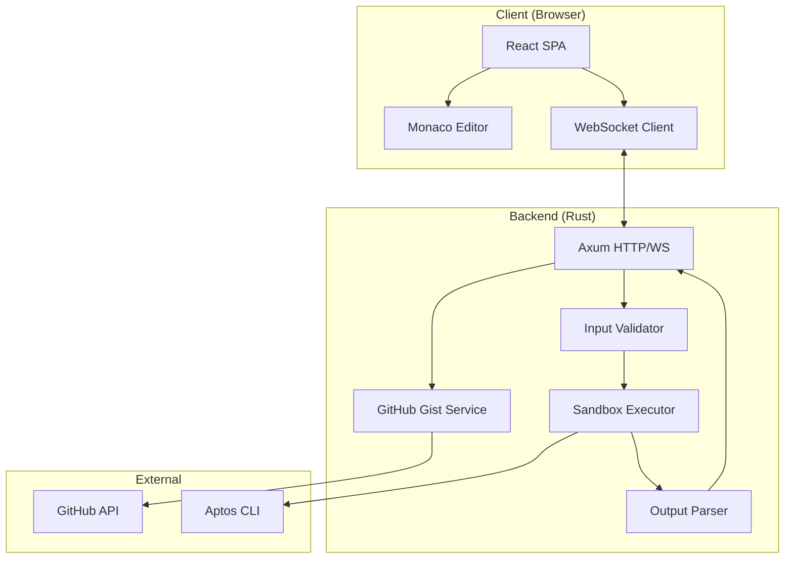
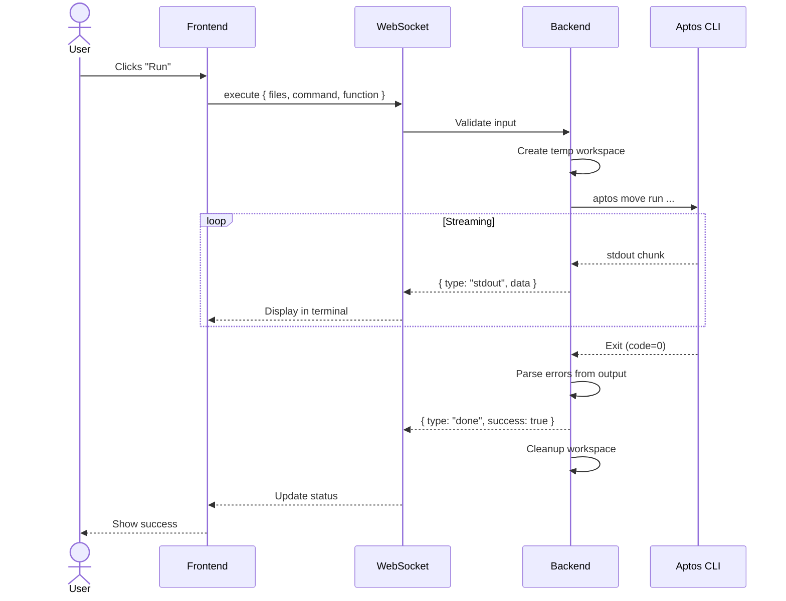
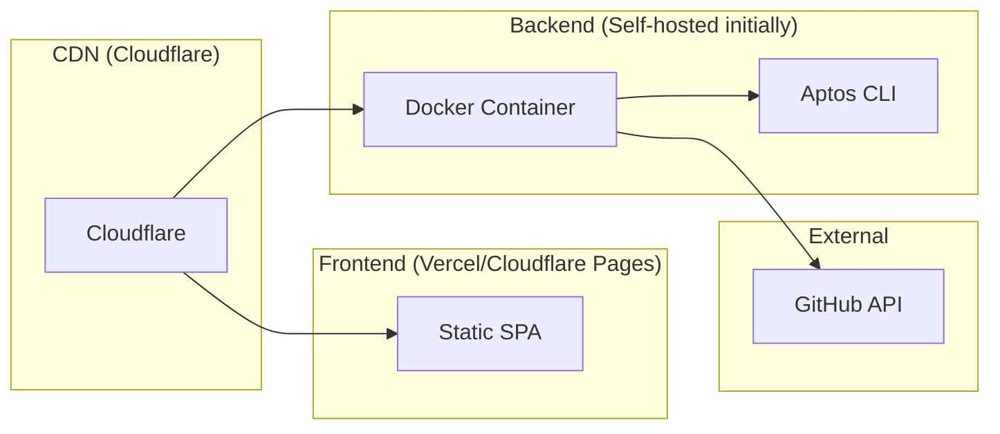

# Aptos Move Playground — Complete Specification

## Table of Contents
1. [Overview](#overview)
2. [User Stories](#user-stories)
3. [System Architecture](#system-architecture)
4. [User Interface](#user-interface)
5. [Features](#features)
6. [Security](#security)
7. [Persistence](#persistence)
8. [Deployment](#deployment)
9. [Edge Cases & Error Handling](#edge-cases--error-handling)
10. [Future Roadmap](#future-roadmap)

---

## Overview

### Vision
A browser-based interactive playground for Aptos Move, enabling developers to:
- Write, compile, and test Move code without local setup
- Share snippets via permalinks
- Embed interactive code examples in documentation and tutorials

### Inspiration
- [Rust Playground](https://play.rust-lang.org/)
- [Go Playground](https://go.dev/play/)
- [TypeScript Playground](https://www.typescriptlang.org/play)

### Non-Goals (MVP)
- Full IDE features (debugging, profiling)
- On-chain deployment
- Multi-user collaboration
- Mobile support

---

## User Stories

### US-1: New Developer Exploration
> As a new Move developer, I want to experiment with Move syntax without installing anything, so I can learn the language quickly.

**Acceptance Criteria:**
- [ ] Landing page loads with a working Hello World example
- [ ] Run button compiles and shows output in under 5 seconds
- [ ] Compiler errors show inline in the editor

### US-2: Documentation Author
> As a documentation author, I want to embed runnable code examples in my docs, so readers can try code immediately.

**Acceptance Criteria:**
- [ ] Embed via `<iframe>` works on any website
- [ ] Embed shows read-only code with "Run" and "Open in Playground" buttons
- [ ] Embed respects `data-theme="light|dark"` attribute

### US-3: Code Sharing
> As a developer, I want to share a snippet with a colleague via URL, so they can see exactly what I wrote.

**Acceptance Criteria:**
- [ ] Share button creates a permalink
- [ ] Permalink loads the exact code, named addresses, and selected function
- [ ] Shared snippets persist for at least 1 year

### US-4: Testing
> As a Move developer, I want to run unit tests in the playground, so I can verify my code works.

**Acceptance Criteria:**
- [ ] Test button runs `aptos move test`
- [ ] Test results show pass/fail status with colors
- [ ] Failed test assertions show source location

---

## System Architecture

### High-Level Diagram


### Sequence: Execute Code


---

## User Interface

### Layout (1440x900)
```
┌─────────────────────────────────────────────────────────────────────────────┐
│ 48px │ [🔷 Move Playground]    [▶ Run ▾] [Share] [Examples ▾]    [⚙ Settings]│
├──────┴──────────────────────────────────────────────────────────────────────┤
│ 200px │                                     │ 320px                         │
│       │                                     │                               │
│ FILE  │         MONACO EDITOR               │  OUTPUT TERMINAL              │
│ TREE  │                                     │  ───────────────              │
│       │  ┌─[main.move]─[Move.toml]─┐        │  $ Compiling...               │
│ ┌───┐ │  │                         │        │  ✓ Build successful           │
│ │src│ │  │  module playground::... │        │                               │
│ │ └─│ │  │                         │        ├───────────────────────────────┤
│ │mai│ │  │                         │        │  CONFIG PANEL                 │
│ └───┘ │  │                         │        │  ─────────────                │
│       │  │                         │        │  Named Addresses:             │
│ Move. │  │                         │        │  playground = [0x1      ] [×] │
│ toml  │  │                         │        │  [+ Add]                      │
│       │  │                         │        │                               │
│       │  │                         │        │  Entry Function:              │
│       │  │                         │        │  [▾ playground::main::hello]  │
│       │  └─────────────────────────┘        │                               │
├───────┴─────────────────────────────────────┴───────────────────────────────┤
│ 24px │ [● Connected]                          [Aptos CLI 2.4.0] [Help] [GitHub]│
└─────────────────────────────────────────────────────────────────────────────┘
```

### Component Details

| Component | Technology | Notes |
|-----------|------------|-------|
| File Tree | Custom React | Drag-drop reorder future |
| Editor | Monaco | Monarch tokenizer for Move |
| Tabs | Headless UI | Closable, reorderable |
| Terminal | xterm.js | ANSI support, scrollback 1000 |
| Config Panel | Headless UI | Collapsible accordion |
| Resizers | react-resizable-panels | Persist sizes to localStorage |

### Color Palette (Dark Theme)
```css
:root {
  --bg-primary: #0d1117;      /* Main background */
  --bg-secondary: #161b22;    /* Panels, sidebars */
  --bg-tertiary: #21262d;     /* Hover, active states */
  --border: #30363d;          /* Borders */
  
  --text-primary: #e6edf3;    /* Main text */
  --text-secondary: #8b949e;  /* Muted text */
  --text-link: #58a6ff;       /* Links */
  
  --accent: #238636;          /* Success, Run button */
  --accent-hover: #2ea043;    
  --warning: #d29922;         /* Warnings */
  --error: #f85149;           /* Errors */
  
  --syntax-keyword: #ff7b72;  /* Move keywords */
  --syntax-string: #a5d6ff;   /* Strings */
  --syntax-number: #79c0ff;   /* Numbers */
  --syntax-comment: #8b949e;  /* Comments */
  --syntax-type: #7ee787;     /* Types */
  --syntax-function: #d2a8ff; /* Functions */
}
```

---

## Features

### F1: Code Editing
| Feature | Implementation |
|---------|----------------|
| Syntax highlighting | Monarch tokenizer |
| Bracket matching | Monaco built-in |
| Auto-indent | Monaco built-in |
| Multiple files | Tab bar + file tree |
| Quick open | Cmd+P fuzzy finder |

### F2: Compilation & Execution
| Command | CLI Equivalent | Notes |
|---------|----------------|-------|
| Compile | `aptos move compile` | Shows warnings inline |
| Run | `aptos move run --function-id ...` | Requires entry function |
| Test | `aptos move test` | Shows pass/fail per test |

### F3: Error Display
| Error Type | Display |
|------------|---------|
| Compiler error | Red squiggle + marker + terminal |
| Warning | Yellow squiggle + marker |
| Runtime error | Terminal only |
| Test failure | Terminal with test name highlighted |

### F4: Sharing
| Aspect | Implementation |
|--------|----------------|
| Storage | GitHub Gists (anonymous) |
| URL format | `https://moveplayground.sed.fyi/?id=<GIST_ID>` |
| Persisted | files, namedAddresses, selectedFunction |
| Expiry | Never (GitHub Gist retention) |

### F5: Embedding
```html
<!-- iframe embed -->
<iframe 
  src="https://moveplayground.sed.fyi/embed?id=ABC123&theme=dark"
  width="100%" 
  height="400"
  style="border: 1px solid #30363d; border-radius: 8px;"
></iframe>

<!-- Script embed -->
<div data-move-playground="ABC123" data-height="400"></div>
<script async src="https://moveplayground.sed.fyi/embed.js"></script>
```

---

## Security

### Threat Model
| Threat | Mitigation |
|--------|------------|
| Code injection (shell) | No shell execution; CLI args array |
| Path traversal | Strict path validation, no `../` |
| DoS (resource exhaustion) | Timeouts, memory limits, rate limiting |
| Malicious dependencies | Git allowlist (github.com, gitlab.com) |
| Data exfiltration | No network access during execution |
| XSS in output | Sanitize ANSI, escape HTML |

### Resource Limits
| Resource | Limit | Enforcement |
|----------|-------|-------------|
| Execution time | 10 seconds | `tokio::time::timeout` |
| Memory | 1 GB | Docker `--memory=1g` |
| Disk | 100 MB | tmpfs mount |
| Stdout | 1 MB | Truncate with `[truncated]` |
| Files | 20 | Validation |
| File size | 50 KB | Validation |
| Concurrent/IP | 2 | Rate limiter |

### Input Validation Checklist
- [ ] File count ≤ 20
- [ ] Each file ≤ 50 KB
- [ ] Total size ≤ 1 MB
- [ ] Paths: no `../`, no absolute, no hidden
- [ ] Extensions: `.move`, `.toml` only
- [ ] Move.toml: valid TOML, has `[package]`
- [ ] Git URLs: host in allowlist
- [ ] Named addresses: valid hex or `_`
- [ ] Entry function: valid identifier format

---

## Persistence

### Gist Structure
```json
{
  "description": "Move Playground Snippet",
  "public": false,
  "files": {
    "Move.toml": { "content": "..." },
    "sources/main.move": { "content": "..." },
    ".playground.json": {
      "content": {
        "namedAddresses": { "playground": "0x1" },
        "selectedFunction": "playground::main::hello",
        "createdAt": "2024-01-15T10:30:00Z",
        "version": "1.0"
      }
    }
  }
}
```

### Future: Custom Pastebin
```sql
CREATE TABLE snippets (
  id TEXT PRIMARY KEY,        -- Short ID (8 chars)
  files JSONB NOT NULL,       -- { path: content }
  metadata JSONB NOT NULL,    -- Named addresses, etc.
  created_at TIMESTAMPTZ DEFAULT NOW(),
  views INTEGER DEFAULT 0,
  expires_at TIMESTAMPTZ      -- Optional expiry
);
```

---

## Deployment

### Infrastructure


### Domains
| Domain | Purpose |
|--------|---------|
| `moveplayground.sed.fyi` | Primary (personal) |
| `playground.aptos.dev` | Official (future) |

### Environment Tiers
| Tier | Frontend | Backend |
|------|----------|---------|
| Development | localhost:3000 | localhost:8080 |
| Staging | staging.moveplayground.sed.fyi | staging-api.moveplayground.sed.fyi |
| Production | moveplayground.sed.fyi | api.moveplayground.sed.fyi |

---

## Edge Cases & Error Handling

### Network Errors
| Scenario | Handling |
|----------|----------|
| WebSocket disconnect | Auto-reconnect with backoff (1s, 2s, 4s... max 30s) |
| Gist API failure | Toast error, retry button |
| Gist not found | Toast "Snippet not found", load default template |
| Slow connection | Show "Still connecting..." after 5s |

### Execution Errors
| Scenario | Handling |
|----------|----------|
| Compilation fails | Show errors inline, in terminal, exit code 1 |
| Runtime abort | Show abort message in terminal |
| Timeout (10s) | Toast "Execution timed out", kill process |
| Memory limit | Toast "Out of memory", kill process |
| Invalid entry function | Toast "Function not found in code" |

### User Errors
| Scenario | Handling |
|----------|----------|
| Empty code | Toast "Please write some code first" |
| No entry function selected | Toast "Select an entry function" |
| Invalid named address | Inline validation, disable Run |
| Unsaved changes + navigate | Confirm dialog "Discard changes?" |

### File Operations
| Scenario | Handling |
|----------|----------|
| Delete last file | Block with toast "Need at least one file" |
| Rename to existing | Block with toast "File already exists" |
| Create with invalid name | Inline validation |
| File too large (paste) | Truncate + toast "Content truncated to 50KB" |

---

## Future Roadmap

### Phase 1: MVP (Weeks 1-4)
- [x] Specification complete
- [ ] Backend: compile, run, test
- [ ] Frontend: editor, file tree, terminal
- [ ] Sharing via GitHub Gists
- [ ] Basic embed (iframe only)

### Phase 2: Polish (Weeks 5-6)
- [ ] Inline error markers
- [ ] Keyboard shortcuts
- [ ] Starter templates
- [ ] Script tag embed

### Phase 3: Scale (Month 2+)
- [ ] Custom pastebin storage
- [ ] GitHub OAuth for snippet management
- [ ] CLI version selection
- [ ] Bytecode viewer
- [ ] Move Prover support

### Phase 4: Ecosystem (Month 3+)
- [ ] VS Code extension integration
- [ ] CI/CD for embedded snippets
- [ ] Analytics dashboard
- [ ] Plugin system for custom templates

---

## Appendix

### Move Syntax Highlighting Keywords
```typescript
const MOVE_KEYWORDS = [
  // Control flow
  'if', 'else', 'while', 'loop', 'return', 'abort', 'break', 'continue',
  
  // Declarations
  'module', 'script', 'struct', 'fun', 'const', 'use', 'as', 'friend',
  
  // Modifiers
  'public', 'entry', 'native', 'inline', 'spec', 'schema', 'invariant',
  
  // Abilities
  'has', 'key', 'store', 'drop', 'copy',
  
  // Other
  'let', 'mut', 'move', 'acquires', 'address', 'phantom',
];

const MOVE_TYPES = [
  'u8', 'u16', 'u32', 'u64', 'u128', 'u256',
  'bool', 'address', 'signer', 'vector',
];
```

### Default Move.toml Template
```toml
[package]
name = "playground"
version = "0.0.1"
authors = []

[addresses]
playground = "_"

[dependencies.AptosFramework]
git = "https://github.com/aptos-labs/aptos-core.git"
subdir = "aptos-move/framework/aptos-framework"
rev = "mainnet"
```

### Default main.move Template
```move
module playground::main {
    use std::debug;
    use std::string;

    public entry fun hello() {
        let message = string::utf8(b"Hello, Move Playground!");
        debug::print(&message);
    }

    #[test]
    fun test_hello() {
        hello();
    }
}
```
